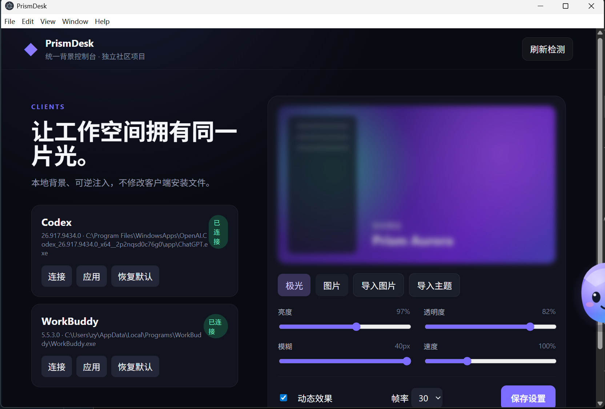

# PrismDesk

[简体中文](README.md) · [English](README.en.md) · [日本語](README.ja.md) · [한국어](README.ko.md) · [Español](README.es.md)

PrismDesk는 같은 로컬 이미지 또는 자체 제작 오로라 애니메이션을 Codex 데스크톱과 WorkBuddy에 각각 적용하고, 클라이언트 창 안에 자체 제작 펫 한 마리를 주입하는 Windows 11용 오픈 소스 외관 도구입니다. 계정, 클라우드, 유료 기능, 테마 마켓을 사용하지 않습니다.

> OpenAI 또는 Tencent와 공식 제휴·승인 관계가 없는 독립 커뮤니티 프로젝트입니다.



## 상태와 기능

현재 버전은 Windows 11 x64용 **`0.1.0-alpha.1`**입니다. Codex 26.917.9434.0과 WorkBuddy 5.5.3.0에서 이미지, 오로라, 재적용, 복원을 실기 검증했으며 WorkBuddy에서는 일시정지도 검증했습니다. 클라이언트 내 플로팅 펫은 자동 테스트(58/58)를 통과했지만 실제 클라이언트에서의 수동 검증은 아직 남아 있으며, 절차와 결과는 [테스트 기록](docs/TEST_RECORD.md)의 매트릭스에 있습니다.

- 설치, 버전, 프로세스, 연결 및 호환 상태 감지.
- PNG/JPEG/WebP와 원격 에셋이 없는 Canvas 오로라.
- 밝기, 투명도, 블러, 속도 및 15/30/60 FPS 조절.
- 클라이언트별 적용, 일시정지, 복원과 중복 없는 주입.
- 임의 스크립트를 실행하지 않는 선언형 테마 검증과 로컬 저장.
- **클라이언트 내 플로팅 펫(기본)**: Codex와 WorkBuddy의 메인 렌더러 페이지에 펫을 주입합니다. 클라이언트 창 안에만 존재하고 드래그와 크기 조절을 지원하며 위치를 클라이언트별로 기억합니다. 투명 영역은 클릭이 통과하고, 한 번 클릭하면 사이드 패널이 열리고 다시 클릭하면 닫힙니다.
- 펫 이미지는 투명 PNG/WebP/GIF를 지원하며 크기, 좌우 반전, 표시/숨김, 기본값 복원을 설정할 수 있습니다. 소재는 이 컴퓨터에만 저장됩니다.
- **Windows 데스크톱 펫(선택)**: 기존의 독립적인 투명 최상위 창이며 설정에서 전환합니다.
- 기본값 복원은 주입한 펫, 패널, 배경, 스타일, 리스너를 한 번에 제거합니다.
- 설정 창을 닫아도 시스템 트레이에서 계속 실행.

## 보안 경계

설치 파일, `app.asar`, 서명을 수정하지 않습니다. Codex는 `127.0.0.1:9222`의 `app://-/index.html`, WorkBuddy는 `127.0.0.1:9223`의 `renderer/index.html`을 검증한 뒤 연결합니다. 펫과 패널은 클라이언트 렌더러 프로세스 안에서 고정 ID의 호스트 요소와 Shadow DOM만 사용하며 페이지 노드에는 리스너를 등록하지 않습니다. 투명 영역 판정은 PrismDesk가 직접 하므로 페이지의 스크롤, 입력, 대화상자는 영향을 받지 않습니다. 주입된 페이지의 요청 큐는 900밀리초마다 메인 프로세스가 가져가며 설정 파일과 동일한 검증을 거칩니다. 채팅 본문과 인증 정보를 읽거나 로그에 기록하지 않습니다.

## 개발 및 패키징

Windows 11 x64와 Node.js 22+가 필요합니다. Electron 38, TypeScript 5, 네이티브 HTML/CSS/DOM, esbuild, electron-builder를 사용하며 React와 Vite는 사용하지 않습니다.

```powershell
git clone https://github.com/XY-code1/PrismDesk.git
cd PrismDesk
npm install
npm run check
npm test
npm run dev
npm run package:win
```

Windows 결과물은 `release/`의 NSIS 설치 파일과 포터블 EXE이며 이 폴더는 Git에서 제외됩니다.

## 펫 형태

클라이언트 내 플로팅 펫이 기본이며, 설정의 宠物形态에서 전환할 수 있고 두 형태는 같은 테마를 공유합니다. Windows 데스크톱 펫은 독립적인 투명 최상위 창이고 위치는 `userData/pet.json`에 저장됩니다. 설정 창을 닫아도 트레이에 남으며 트레이 메뉴의 退出 PrismDesk로 완전히 종료합니다.

## 제한

주입은 세션 단위이며, 클라이언트를 CDP 포트와 함께 실행했다면(PrismDesk의 连接 사용) 클라이언트가 다시 나타난 뒤 몇 초 안에 PrismDesk가 자동으로 다시 주입하고 기억한 위치도 복원합니다. 클라이언트 업데이트 후에는 재검증이 필요합니다. 입력, 코드 복사, 긴 스크롤, 모든 대화상자, 깨끗한 시스템에서의 업데이트·제거는 수동 확인 항목입니다. 펫 크기, 좌우 반전, 표시 여부는 두 클라이언트가 공유하고 위치만 클라이언트별로 기억합니다. Wallpaper Engine은 2단계로, 공개된 통합 방식과 탐지 가능한 경로 조사만 진행했습니다([조사 노트](docs/RESEARCH-WALLPAPER-ENGINE.md)). Steam 창작마당 자료를 가져오거나 타인의 배경을 저장소에 포함하지 않습니다. 테스트 빌드는 상용 코드 서명이 없습니다.

[아키텍처](docs/ARCHITECTURE.md) · [호환성](docs/COMPATIBILITY.md) · [테스트](docs/TEST_RECORD.md) · [기여](CONTRIBUTING.md) · [제3자 라이선스](THIRD_PARTY_NOTICES.md)

원본 코드는 [MIT License](LICENSE)로 제공됩니다.
