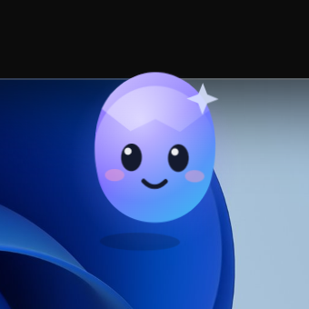

# PrismDesk

[简体中文](README.md) · [English](README.en.md) · [日本語](README.ja.md) · [한국어](README.ko.md) · [Español](README.es.md)

PrismDesk 是一个面向 Windows 11 的开源桌面外观工具，用同一套本地图片或原创极光动画分别装饰 Codex 桌面版与 WorkBuddy，并把一只原创小宠物注入客户端窗口内部。项目完全在本机工作，不提供账号、云端服务、付费功能或主题商城。

> PrismDesk 是独立社区项目，与 OpenAI、腾讯及其产品不存在隶属、授权或背书关系。


## 当前状态

当前版本为 **`0.1.0-alpha.1`**，目标平台为 Windows 11 x64。

| 客户端 | 实测版本 | 当前结果 |
|---|---:|---|
| Codex 桌面版 | 26.917.9434.0 | 图片、极光、重复应用、恢复通过 |
| WorkBuddy | 5.5.3.0 | 图片、极光、重复应用、暂停、恢复通过 |

客户端内悬浮宠物的自动化测试已通过（58/58），真实客户端的人工验证矩阵见 [测试记录](docs/TEST_RECORD.md)，仍需在带桌面的环境中补完剩余条目后才能声明"已实测"。精确范围和未验证项目见 [兼容性列表](docs/COMPATIBILITY.md)。

## 功能

- 检测 Codex、WorkBuddy 的安装、版本、进程、连接与适配状态。
- 导入本地 PNG、JPEG、WebP 图片，以及不依赖远程素材的 Canvas 极光动画。
- 调节亮度、透明度、模糊、动画速度及 15/30/60 FPS。
- 分别向两个客户端应用同一主题，暂停动画或恢复默认外观。
- **客户端内悬浮宠物（默认）**：把原创宠物注入 Codex 与 WorkBuddy 的主渲染页，宠物只能存在于客户端窗口内部，可拖动、缩放，并按客户端分别记住位置。
- 单击宠物在该客户端内打开 PrismDesk 侧边面板，再次单击关闭；面板提供背景、参数、暂停动画与宠物形象等全部设置。
- 宠物形象支持导入透明 PNG、WebP、GIF，可设置尺寸、水平镜像、显示/隐藏与恢复默认；素材只保存在本机。
- 透明像素不拦截原页面：不透明的角色轮廓才接收指针，滚动、输入、复制、选择与弹窗都不受影响。
- 幂等注入：重复应用不会叠加宠物、面板、背景节点或动画循环；页面切换或重载后自动恢复。
- **Windows 桌面宠物（可选）**：保留原有的独立透明置顶窗口，可在设置中切换。
- 恢复默认会一次性清除 PrismDesk 注入的宠物、面板、背景、样式与监听器。
- 主题配置严格校验，不执行主题脚本；设置和素材资源仅保存在本地。
- 关闭设置窗口后驻留系统托盘，可重新打开或完整退出。

## 工作方式与安全边界

PrismDesk 不修改客户端安装文件、`app.asar`、签名或完整性数据。适配器只连接由指定客户端拥有的本机回环 CDP 端口，并验证客户端专属主渲染页：

- Codex：`127.0.0.1:9222`，精确目标 `app://-/index.html`。
- WorkBuddy：`127.0.0.1:9223`，目标包含 `renderer/index.html`。

客户端内的宠物与面板运行在客户端的渲染进程里，只使用固定 ID 的两个宿主节点和两个 Shadow DOM，永远不向页面节点注册监听器；角色按剪影裁剪后才是指针目标，透明区域不接收指针，落在角色上的滚轮会转发给其下方的滚动容器，因此原页面的滚动、输入与弹窗不受影响。被注入页面的请求队列每 900 毫秒由主进程取走一次，所有内容都要经过与配置文件相同的严格校验。

当客户端正在运行但没有开启 CDP 时，PrismDesk 不会自动重启它，以避免中断任务。连接和诊断不会读取聊天正文或账号凭据，日志也不记录页面正文。

## 环境与技术栈

- Windows 11 x64、Node.js 22+
- Electron 38、TypeScript 5
- 原生 HTML/CSS/DOM（未使用 React）
- esbuild（未使用 Vite）、electron-builder

## 本地开发

```powershell
git clone https://github.com/XY-code1/PrismDesk.git
cd PrismDesk
npm install
npm run check
npm test
npm run dev
```

`npm run dev` 会先用 esbuild 构建主进程、预加载脚本和渲染器，然后启动 Electron。

## Windows 打包

```powershell
npm run package:win
```

打包命令不会跳过检查或测试，会依次运行类型检查、测试、构建以及 NSIS/Portable 打包。产物位于 `release/`：

- `PrismDesk-Setup-0.1.0-alpha.1-x64.exe`
- `PrismDesk-Portable-0.1.0-alpha.1-x64.exe`

项目配置了 Electron 下载镜像与重试，依赖版本仍由 `package-lock.json` 锁定。`release/` 已被 Git 忽略，安装包不会随源码提交。

## 使用

1. 启动 PrismDesk，查看两个客户端的检测状态。
2. 如果目标客户端尚未运行，点击"连接"。
3. 如果客户端已运行但显示需要重启，请保存任务、手动退出客户端，再点击"连接"。Codex 也可运行 `Start-Codex-for-PrismDesk.cmd`。
4. 选择"极光"或导入本地图片，调整参数，然后在目标客户端卡片上点击"应用"。应用会同时注入背景、悬浮宠物和侧边面板。
5. 在设置窗口的"宠物形态"里选择"客户端内悬浮宠物"或"Windows 桌面宠物"；后者会移除客户端内的宠物与面板，改为独立桌面窗口。
6. 点击"恢复默认"清理当前会话中的 PrismDesk 注入。

## 宠物形态



**客户端内悬浮宠物（默认）**

- 宠物是客户端窗口内的一个小部件，不会出现在客户端窗口之外，也不会成为独立窗口或任务栏按钮。
- 拖动角色移动位置，右下角手柄缩放（40–160 px）；默认出现在窗口右上角并避开客户端自身的标题栏区域，位置按客户端分别保存在 Electron `userData/in-app-pet.json`。
- 单击角色打开 PrismDesk 侧边面板，再次单击关闭；面板里可以调背景、参数、暂停动画，也能导入宠物形象。
- 只有角色不透明像素接收指针，其余区域点击穿透；宠物在手势期间的鼠标事件不会传到页面。
- 宠物形象支持透明 PNG、WebP、GIF（单文件 ≤ 4 MB，按文件内容校验类型），导入后复制到 `userData/themes/pet-assets`，只在本机使用。

**Windows 桌面宠物（可选）**

- 独立的透明置顶窗口，可浮在桌面任意位置；位置保存在 `userData/pet.json`。
- 单击 Prism 打开或聚焦设置窗口；透明区域鼠标穿透，显示器变化后会重新约束到可见区域。

两种模式共用同一份主题；关闭设置窗口只会隐藏窗口，从托盘菜单选择"退出 PrismDesk"才会完全退出。

## 配置与卸载

主题配置位于 Electron `userData/themes/config.json`，导入的背景图片复制到同一 `themes` 目录的 `assets/` 中，宠物形象复制到 `pet-assets/`。卸载前建议先为每个已连接客户端执行"恢复默认"。如需删除保留配置，可手动删除 `%APPDATA%\PrismDesk`。

## 已知限制

- 背景与客户端内宠物都是会话级的；只要客户端仍带 CDP 端口启动（例如通过 PrismDesk 的"连接"），PrismDesk 会在客户端重新出现后数秒内自动重新注入。否则需要再次"应用"（记住的位置会随配置自动恢复）。
- 客户端更新可能改变 DOM；PrismDesk 会停止未知结构的适配，而不是盲目注入。
- 输入、代码复制、长页面滚动、全部弹窗以及干净系统上的升级/卸载仍属于人工发布检查项目，矩阵见测试记录。
- 宠物尺寸、镜像与显示开关由两个客户端共用，只有位置是按客户端分别记忆的。
- 在客户端内导入的 GIF 会继续播放：暂停动画开关作用于背景、内置角色和面板，不控制第三方动图的帧。
- Wallpaper Engine 属于第二阶段，目前只完成公开集成方式与可检测路径的调查，见 [研究报告](docs/RESEARCH-WALLPAPER-ENGINE.md)；不抓取 Steam 创意工坊资源，也不打包他人壁纸。
- 当前测试构建未进行商业代码签名，并使用默认 Electron 应用图标。

## 文档

[架构](docs/ARCHITECTURE.md) · [兼容性](docs/COMPATIBILITY.md) · [测试记录](docs/TEST_RECORD.md) · [适配研究](docs/RESEARCH.md) · [Wallpaper Engine 调查](docs/RESEARCH-WALLPAPER-ENGINE.md) · [演示流程](docs/DEMO.md) · [贡献指南](CONTRIBUTING.md) · [第三方声明](THIRD_PARTY_NOTICES.md)

## 多语言与贡献

README 提供简体中文、英语、日语、韩语和西班牙语。翻译必须以实际功能为准，不能把未实测兼容性写成"已支持"。欢迎按 [CONTRIBUTING.md](CONTRIBUTING.md) 提交修正或新增语言。

## License

原创代码使用 [MIT License](LICENSE)。第三方内容继续遵循各自许可证，详见 [THIRD_PARTY_NOTICES.md](THIRD_PARTY_NOTICES.md)。
