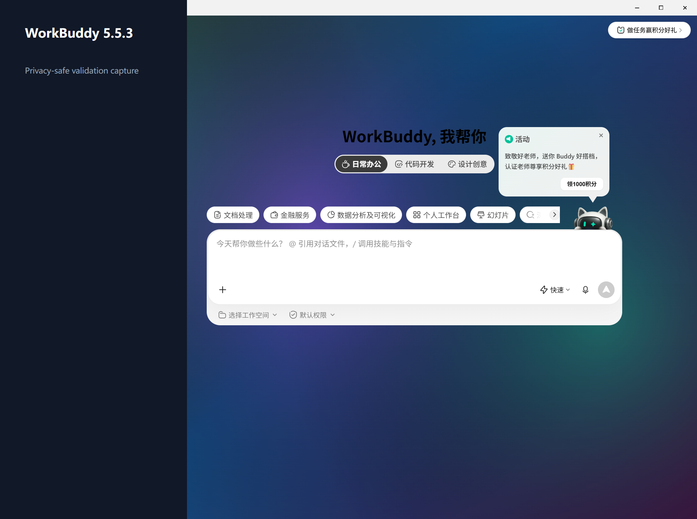
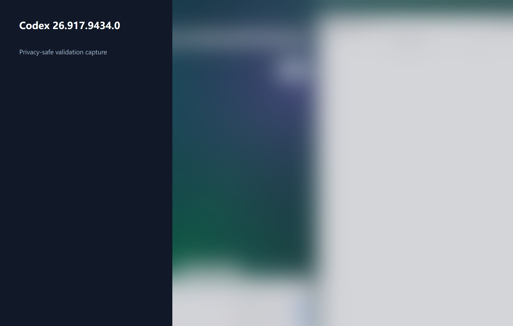
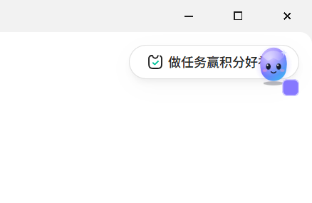
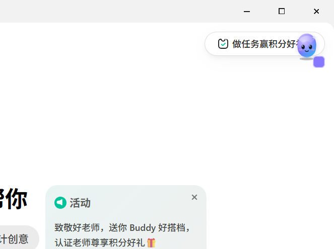
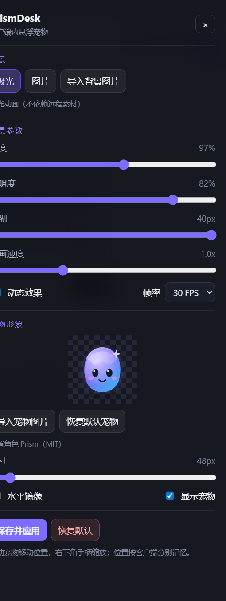

# Test record — Windows 11 — 2026-09-25

## Automated

Commands:

```text
npm run check  -> PASS
npm test       -> PASS (7/7)
npm run build  -> PASS
```

Covered: strict theme validation (unknown script field and ranges rejected), closed/invalid CDP ports, declarative injection generation, scoped cleanup, and settings reload from a new Store instance.

## WorkBuddy 5.5.3.0 — real client

Executable detected at the standard per-user install location. It was not running, so PrismDesk launched it with `--remote-debugging-address=127.0.0.1 --remote-debugging-port=9223`. The discovered target was a WorkBuddy `renderer/index.html` page on the loopback WebSocket endpoint.

| Check | Result |
|---|---|
| Aurora apply | PASS — one renderer acknowledged `prismdesk-background` |
| Re-apply | PASS — exactly 1 background, 1 style, 1 canvas |
| Image apply | PASS — one managed `data:image/png;base64` image node |
| Motion off | PASS — static frame retained; no repeating RAF is started by payload branch |
| Restore | PASS — renderer reported restored; follow-up status was connected/not applied |
| Visual readability | PASS — privacy-safe screenshot below |
| Input, copy, scroll, modal | NOT YET MANUALLY EXECUTED; no claim of verification |



The screenshot masks the entire sidebar before capture and contains no chat list, account identifier, credential, or user background. The temporary mask was removed before restoration.

## Codex 26.917.9434.0 — real client

The validated Microsoft Store package was launched with loopback CDP. Port ownership was checked against the exact Store executable and only the exact main renderer URL `app://-/index.html` was selected; avatar, detached-window, browser, and sandbox targets were excluded.

| Check | Result |
|---|---|
| Aurora apply | PASS — one exact main renderer acknowledged the layer |
| Image apply | PASS — one local PNG data URL image node |
| Re-apply | PASS — exactly 1 background, 1 style and 1 canvas |
| Restore | PASS — renderer reported restored and follow-up status was connected/not applied |
| Visual background | PASS — privacy-blurred screenshot below |
| Input, copy, scroll, modal | NOT YET MANUALLY EXECUTED; no claim of verification |



## Packaging

Renderer/main bundles and Windows packages were produced. `release/PrismDesk-Setup-0.1.0-x64.exe` and `release/PrismDesk-Portable-0.1.0-x64.exe` were generated; the unpacked executable remained running for the six-second smoke window. The binaries are unsigned community builds.

## Packaging and network fix - 2026-09-25 (0.1.0-alpha.1)

Failing symptom: `npm run package:win` aborted with `connect ETIMEDOUT 20.205.243.166:443`.

Root cause: the Electron runtime artifact was requested directly from
`https://github.com/electron/electron/releases/download/v38.8.6/electron-v38.8.6-win32-x64.zip`
(that host resolves to 20.205.243.166). The npmmirror endpoints were only injected by
`scripts/package-win.mjs`, so `npm install` (electron postinstall) and a direct `electron-builder`
invocation fell back to GitHub. The `installing native dependencies` stage itself performs no network
request: the only production dependency is `ws` and the tree contains no `binding.gyp`, so
`@electron/rebuild` finds zero modules.

Fix: `electron_mirror` and `electron_builder_binaries_mirror` in `.npmrc`. npm exports both to every
lifecycle script as `npm_config_electron_mirror` / `npm_config_electron_builder_binaries_mirror`, and
`@electron/get` prefers those over `ELECTRON_MIRROR`. No dependency version was changed and no build
step was removed.

Second defect found by running the packaged build: `release/PrismDesk-Portable-0.1.0-x64.exe` opened
an Electron error window - `A JavaScript error occurred in the main process / Error: Dynamic require
of "events" is not supported`. `scripts/build.mjs` bundled the CommonJS `ws` package into the ESM
main bundle, so the esbuild dynamic-require shim threw during load. Fixed with a `createRequire`
banner on the main bundle; the packaged app then rendered its window (Codex card showed the detected
26.917.9434.0 client, WorkBuddy card 5.5.3.0).

## Client verification - 2026-09-25 (machine-assisted pass)

Clients: Codex desktop `26.917.9434.0` (Store package `OpenAI.Codex`, loopback CDP, main target
`app://-/index.html`) and WorkBuddy `5.5.3.0` (per-user Electron install, loopback CDP,
`renderer/index.html`). Injection used the shipped `src/main/injection.ts` payloads; no client
install file was modified and every check ended with a restore.

| Check | Codex 26.917.9434.0 | WorkBuddy 5.5.3.0 |
|---|---|---|
| Aurora apply, one `prismdesk-background`, one `prismdesk-style` | PASS | PASS |
| Layer is `pointer-events:none`, z-index 0, `#root` z-index 1 | PASS | PASS |
| 40-point `elementFromPoint` occlusion sweep | PASS, 0/40 blocked | PASS, 0/40 blocked |
| Composer not covered (hit test at input centre) | PASS | PASS |
| Input accepts a 7-character probe, then cleared; nothing sent | PASS | PASS |
| Scroll of the largest real scroll container | PASS (0 -> 1, 5127 px of range) | NOT VERIFIED, no scroll container existed in the state tested |
| Ctrl+C with the background applied | PASS once (36-character selection, OS clipboard length matched); later repeats inconclusive because the window was hidden and no selection could be made | Copy event fired with a 164-character selection; OS clipboard payload not readable from the automation context |
| Synthetic top-layer element wins over the background | PASS | PASS |
| Motion animation advances | NOT VERIFIED, the window reported `document.hidden=true` throughout and a control rAF loop also received 0 ticks | PASS, canvas content changed across 1.6 s (490 control frames) |
| Paused when the client is hidden/minimized | PASS, frames static, rAF suspended | PASS |
| Re-apply is idempotent (1 background, 1 style, 1 canvas) | PASS | PASS |
| Image apply from a generated 320x180 PNG | PASS, one `data:image/png` node | PASS, one `data:image/png` node |
| Restore, then computed baseline equality | PASS | PASS |

Still unverified and to be confirmed by hand: client-native modal/dialog interaction (the modal check
above only proves layer ordering), paste-level copy output, Codex motion animation with the window
visible, and WorkBuddy scrolling. No new screenshots were taken in this pass, so the privacy-masked
images above remain the only published evidence.

Packaging ran again after the fix: `npm run package:win` exited 0 with every artifact download served
by npmmirror and no `github.com` request. The `release/` installers are unsigned community builds
(`signHook=false cscInfo=null`).

## Blocking-issue fix - 2026-09-26 (0.1.0-alpha.1 development build)

Reported blockers: in Codex the chat input was reported unusable after applying a background, and in
WorkBuddy re-apply, kind switching and restore-default behaved abnormally. Both clients were exercised
live before and after the change. No installer was produced from this change.

### Reproduction

Codex desktop `26.917.9434.0` (Store package, loopback CDP 9222, main target `app://-/index.html`; the
avatar window `app://-/index.html?initialRoute=%2Favatar-overlay` is a second page target and is
excluded by the exact-URL rule):

- The delivered payload (layer at `z-index:0`, plus `#root{position:relative;z-index:1}`) **painted
  nothing when the client window was hidden/occluded at apply time**. `draw()` returned immediately on
  `document.hidden` without rescheduling, and the `motion:false` branch skipped its single frame for
  the same reason, so a capture taken right after apply showed an empty background while a later
  capture showed the aurora.
- The canvas backing store used `innerWidth/devicePixelRatio`: 854x544 for a 1280x816 viewport at
  DPR 1.5, i.e. an undersized, soft background.
- An input-blocking mechanism could **not** be reproduced: the 49-point `elementFromPoint` sweep was
  identical before and after apply, the composer centre hit tested to `.ProseMirror`, click-to-focus,
  an 8-character `Input.insertText` and clearing all succeeded, and Ctrl+C produced the expected copy
  event. The one structural change the old payload made to the host app was forcing `#root` to
  `position:relative;z-index:1`, which turns the client root into a stacking context and can trap
  app-owned overlays and popups - a hard requirement here - so it was removed rather than left
  unproven.

WorkBuddy `5.5.3.0` (per-user install, loopback CDP 9223, `renderer/index.html`):

- The delivered CSS used `[data-view-id]`, `[data-view-id=sidebar]`, `[data-view-id=detail-panel]` and
  `[data-view-id=main-content]`. In WorkBuddy those attributes are **not** layout landmarks: they match
  four unrelated home-grid cards (`_gridViewItem_1ens7_14`), so applying a background restyled app cards
  with `backdrop-filter:blur(18px)`, a `color-mix` background and a `linear-gradient`. The effect
  appeared and disappeared as the user switched routes; this is the reproduced switching anomaly.
- Layer counts, `#root` state, cleanup handlers and the restored `.teams-container` background were
  already correct across apply/re-apply/switch/restore, so no idempotency defect was found.
- The status pill can lag one action behind because a single status call takes about 3.5 s per client
  (each call spawns several PowerShell processes). Observed, not a correctness defect.

### Change

- `src/main/injection.ts`: the layer is now `z-index:-1` with `pointer-events:none`, and the payload no
  longer touches the client's `#root` stacking, so the layer is behind every client node and cannot
  cover or intercept input, selection, copy, scroll, popups or shortcuts.
- The first frame is painted synchronously during apply, before any visibility test, so the background
  appears even when PrismDesk's own window was in front during apply. `document.hidden` now only pauses
  the animation loop, and `visibilitychange` repaints and resumes it.
- The canvas backing store is `innerWidth x devicePixelRatio` (clamped 1..4), so scaled displays get a
  correctly sized background.
- The coincidental `[data-view-id]` rules were dropped; only selectors verified on real client nodes
  remain.
- `statusScript` reports a painted flag (sampled canvas alpha), so an applied-but-never-painted layer is
  detectable, and cleanup uses `querySelectorAll('#prismdesk-...')`.

### Automated

```text
npm run check  -> PASS
npm test       -> PASS (13/13, 6 new regression assertions)
npm run build  -> PASS
```

The new assertions lock in: layer behind everything with no `#root` mutation, a synchronous first paint
for both `motion` values, a DPR-sized canvas, no `[data-view-id]` selectors, a data-URL-only image
payload, and the painted status field.

### Real-client matrix after the change

| Check | Codex 26.917.9434.0 | WorkBuddy 5.5.3.0 |
|---|---|---|
| Apply aurora, motion on | PASS - 1 layer/1 style, `painted:true` | PASS - 1/1, `painted:true` |
| Re-apply | PASS - still exactly 1/1/1 | PASS - 1/1/1 |
| Switch to image | PASS - 1 layer/1 img/0 canvas | PASS - 1 layer/1 img/0 canvas |
| Pause (motion off) | PASS - one static frame painted | PASS - one static frame painted |
| Restore default | PASS - 0 layers/0 styles, `#root` untouched | PASS - 0/0, `.teams-container` back to `rgb(242,242,242)` |
| After client restart | PASS - connected and not applied; a plain restart reports `needs_restart` | PASS - connected and not applied |
| Layer hit-testing | PASS - 49-point sweep identical to the pre-apply baseline | PASS - identical |
| Composer | PASS - click focuses `.ProseMirror`, 8-char insert, then cleared | PASS - click focuses `_editable_*`, insert, then cleared |
| Selection + Ctrl+C | PASS - 8-char selection, copy event fired with matching text | PASS - 8-char selection, copy event fired |
| Scroll | container hit tests to an app node and scrolls programmatically (0 -> 240 px) | container hit tests to `_title_914ll_23` and scrolls to its 158 px maximum |
| Motion animation | PASS - canvas pixels changed over 1.3 s with the window visible | NOT VERIFIED - no compositor frames while occluded |
| Paused while hidden | PASS - frames static, CPU at baseline | PASS - frames static |
| Unintended client styling | PASS - no `[data-view-id]` matches remain | PASS - `_gridViewItem_*` cards keep `backdrop-filter:none` |
| PrismDesk UI path | PASS - refresh, apply and restore each reported success in the UI | PASS - same |

### Not verified / limits of this pass

- Wheel events delivered through CDP were only acknowledged while a client window was visible; in the
  occluded state no compositor frames were produced and the dispatch timed out, so wheel-driven
  scrolling is still unconfirmed. Hit testing, pointer-event transparency and programmatic scrolling
  were confirmed instead.
- WorkBuddy produced no compositor frames while occluded, so no WorkBuddy screenshot or canvas
  time-series could be captured in this pass; its layer was verified with DOM/state probes and the
  painted flag. The privacy-masked screenshots above remain the only published images.
- Real keyboard and IME typing could not be exercised on the client windows because this session has no
  interactive desktop; text was injected through `Input.insertText` and key events were confirmed to
  reach the page.
- Codex CPU cost could not be attributed to the layer: the app's own start-up load dominated the
  sampling window and the window was hidden (animation paused) for most of it.
- Client-native modal and window-manager behaviour still needs a manual pass on an interactive desktop.

## Desktop pet entry - 2026-09-26 (feat/desktop-pet)

### Automated

```text
npm run check  -> PASS
npm test       -> PASS (26/26, 15 of them new pet rules)
npm run build  -> PASS (also regenerates dist/assets/tray.png and tray@2x.png)
```

The new unit tests cover position-schema validation including unknown-field rejection, a tampered
`pet.json` falling back instead of throwing, restart/straddling/removed-display/resolution-change
clamping, the hit ellipse (only the character silhouette takes the pointer), and the 4 px drag
threshold that separates a click from a move.

### Live run on the real desktop

Windows 11, single display 2560x1600 at 150% scaling, so 1 DIP = 1.5 physical px. The pet started at
the stored position and every measurement below is a real window probe (`GetWindowRect`,
`GetWindowLongW(GWL_EXSTYLE)`, `IsIconic`) or a real synthetic mouse gesture, run in one process so
that no PowerShell round-trip can distort the timing.

| Check | Result |
|---|---|
| Pet window geometry | PASS — 168x168 DIP (`252x252`/`255x255` physical), transparent, `WS_EX_LAYERED`, `WS_EX_NOACTIVATE`, topmost, no taskbar button |
| Transparent margin is click-through | PASS — hover the corner: `WS_EX_TRANSPARENT` set; click there leaves the settings window hidden |
| Character area takes the pointer | PASS — hover the centre: `WS_EX_TRANSPARENT` cleared within one 32 ms poll |
| Drag moves the pet | PASS — a `(-250,-180)` gesture moved the window `-240,-172` (the difference is the 4 px threshold plus one 12.5 px step, by design) |
| Drag does not change the window size | PASS — still 168 DIP after three drags (this was a real bug: `setPosition` alone grew it to 254 DIP) |
| Drag never opens the settings window | PASS — settings stayed hidden through every drag, including a drag started while it was parked |
| Click the character | PASS — settings window became visible and was the foreground window |
| Close the settings window | PASS — `close` -> cancelled -> hidden: `visible=false iconic=false`, and the pet was still on the desktop |
| Close while a stray minimise is in flight | PASS — the parked state is re-asserted; no taskbar button appears for a window the user closed |
| Click the character again | PASS — settings window shown and focused again |
| Stray minimise after `show()` | PASS (mitigated) — the environment minimised a freshly shown window at +1.7 s, +1.8 s and +3.5 s in different runs, and reproduced it with a bare Electron window with no PrismDesk code; the guard restores the window, so the settings UI never vanishes on its own |
| Tray icon exists | PASS — found through UI Automation: `PrismDesk 桌宠`, 60x60 next to the taskbar in the notification-area flyout |
| Remembered position across a restart | PASS — `pet.json` `{x:1324,y:588}` -> the relaunched pet sat at physical `1986,882` = `1324,588` DIP |
| Both clients connected | PASS — `targets:status` reported Codex 26.917.9434.0 and WorkBuddy 5.5.3 with `已连接`, and loopback ports 9222/9223 were both accepting connections |
| Tray menu items themselves | NOT AUTOMATED — see below; the icon is present and its menu is the two labels built in `main.ts` |

### Findings that produced code changes

1. **Per-monitor-DPI size drift.** With 150% scaling, moving the pet with `setPosition()` alone grew
   the window from 168 to 254 DIP over two drags. Every move now writes the full intended size with
   `setBounds()`.
2. **A click-through window stops receiving mouse events entirely, and the renderer cannot toggle the
   flag back.** With `setIgnoreMouseEvents(true)` Windows delivers no mouse messages to the window at
   all (not even forwarded ones), so the renderer can never notice that the cursor came back. The hit
   test therefore lives in the main process, which polls the cursor and toggles the flag; the renderer
   keeps `isPetHit()` as a second guard on `pointerdown`.
3. **A stray minimise of a freshly shown window.** Reproduced without any PrismDesk code, so it is a
   property of this desktop, not of the pet. A stray minimise inside a short window after `show()` is
   reverted, and a parked window is re-hidden instead of being left iconic, which is what would
   otherwise strand a taskbar button for a closed window.

### Not verified / manual steps

The Windows 11 notification-area flyout is a XAML island: UI Automation can focus the PrismDesk icon
(`name=[ PrismDesk 桌宠] rect=2077,1262 60x60`) and `Win+B` reaches the taskbar, but synthetic
right-clicks and the Applications key are both swallowed, so the two menu items could not be clicked
from this session. Please confirm by hand:

1. Right-click the PrismDesk gem in the notification area (under “显示隐藏的图标” if hidden) and check
   the menu reads `打开设置` / `退出 PrismDesk`.
2. `打开设置` shows and focuses the settings window.
3. Close the settings window: it disappears from the taskbar and desktop while the pet stays put and
   the tray icon remains.
4. `退出 PrismDesk`: the pet disappears, the tray icon disappears, and no `PrismDesk`/`electron`
   process is left in Task Manager.

Also still manual: dragging the pet across two real monitors, and unplugging a monitor while the pet
is on it (the clamp is unit-tested for both, but not exercised on two physical displays here).
# In-client floating pet - 2026-09-26 (feat/in-app-pet)

## Automated

```text
npm run check  -> PASS
npm test       -> PASS (49/49: 11 core, 13 desktop-pet, 2 adapter/CDP, 23 in-client pet)
npm run build  -> PASS (main/preload/renderer/pet bundles plus tray icons)
```

The 23 new tests live in `tests/in-app-pet.test.ts` and cover:

- pet appearance schema (size range, booleans, unknown fields, empty artwork path) and the theme v2
  schema including the migration of a v1 file and the rejection of an unknown pet mode;
- box geometry: default bottom-right placement, clamping inside the client window, a window smaller
  than the pet;
- hit testing: the built-in character silhouette versus its transparent margin, alpha threshold,
  drag threshold;
- mirrored sampling and resize-handle geometry, size clamping;
- artwork validation by content: PNG (with and without alpha), WebP (VP8X/VP8L flags), GIF, a JPEG,
  an SVG, an extension/content mismatch, an oversized file and an empty buffer;
- the managed artwork copy: `pet-assets/pet.<ext>`, data URL generation, replacement on re-import and
  removal on reset;
- the inlined runtime: every function of `RUNTIME` is present *and* a fresh `Function` built from the
  inlined source returns the same answers as the imported functions, so the page copy cannot drift
  from the tested copy;
- request validation (`parseInAppRequests`): unknown types dropped, non-integer or absurd coordinates
  dropped, resize clamped into range;
- per-client memory: `in-app-pet.json` round-trip, tampered file falls back to empty, per-client
  independence;
- the payload itself, executed against a model document: one pet and one panel after four injections,
  click toggles the panel, the panel's close button works, a click on the page closes the panel
  without stealing the click, a press on the character is consumed while a press elsewhere is not,
  `wheel`/`keydown`/`input` always reach the page, the payload adds no listener to page nodes,
  transparent artwork pixels fall through, the mirrored sample coordinate is flipped, drag clamps to
  the window and queues one `move`, the grip queues one `resize`, a slider previews locally and is
  debounced into one `save`, and restore removes every node, style, marker and listener;
- the panel's own state: the 尺寸 control resizes the character on the spot instead of waiting for
  main to echo the stored theme back, and a state push that main queued before it had stored the
  edit never snaps a control the user is still holding back to the value it replaced;
- recovery: a fresh page reports `present:false` and receives exactly one pet and one panel again.

Automated coverage limits, stated plainly: the model document is not a browser. It reproduces window
capture ordering, `stopImmediatePropagation`, shadow-root retargeting and the payload's own listeners,
but it does not prove anything about a real client's DOM, its CSS, its scroll containers, its modals
or its clipboard. That is what the manual matrix below is for.

## Environment at the time of writing

Both clients are installed on the development machine - Codex desktop `26.917.9434.0` (Store package
`OpenAI.Codex_26.917.9434.0_x64__2p2nqsd0c76g0`) and WorkBuddy `5.5.3.0`
(`%LOCALAPPDATA%\Programs\WorkBuddy\WorkBuddy.exe`) - but neither was running with a loopback CDP port
(`Get-NetTCPConnection -LocalPort 9222,9223` returned 0 listeners) and no desktop session was driven
while this branch was written. The matrix below is therefore a procedure with results still pending;
it must be executed with the clients running before any release is tagged.

## Manual matrix - Codex 26.917.9434.0 / WorkBuddy 5.5.3.0

Setup per client: start the client through PrismDesk's 连接 button (or `Start-Codex-for-PrismDesk.cmd`)
so that the loopback CDP port is owned by that client, press 应用 in PrismDesk, and confirm the status
pill reads 已应用 · 悬浮宠物.

| # | Check | How to verify | Codex | WorkBuddy |
|---|---|---|---|---|
| 1 | Apply is idempotent | After 应用, inspect the renderer: exactly 1 `#prismdesk-pet-host`, 1 `#prismdesk-panel-host`, 1 `#prismdesk-pet-style` | PENDING | PENDING |
| 2 | Drag | Press the character, drag around the window, release: the pet follows without lag, never leaves the window, and stays where it was put after restarting PrismDesk | PENDING | PENDING |
| 3 | Scale | Drag the bottom-right grip, then drag the panel's 尺寸 slider: the character scales between 40 and 160 px immediately in both directions, with no snap-back while a control is still held | PENDING | PENDING |
| 4 | Click toggles the panel | Single click opens the side panel, a second click closes it, and the page content behind it is unchanged | PENDING | PENDING |
| 5 | Transparent area does not intercept | Click through the transparent margin onto a chat input and onto a toolbar button: both react normally | PENDING | PENDING |
| 6 | Input | With the pet visible, type a short probe message, then clear it: the text appears exactly once, no caret jump, nothing sent | PENDING | PENDING |
| 7 | Copy | Select text in a message or code block, Ctrl+C, paste into Notepad: the content matches the selection | PENDING | PENDING |
| 8 | Scroll | Wheel over the character and over the message list: the character forwards the wheel to the scroller underneath it, so scrolling is smooth and never jumps or stalls | PENDING | PENDING |
| 9 | Popups | Open a client menu/dialog, then click the pet and click outside: no dialog closes because of the pet, and outside clicks still close what they should | PENDING | PENDING |
| 10 | Page switch | Move between views/routes: exactly one pet remains, at the remembered position | PENDING | PENDING |
| 11 | Reload | Reload the renderer (Ctrl+R or a client-triggered reload): the pet returns within about two seconds with one panel | PENDING | PENDING |
| 12 | Re-apply | Press 应用 three times, then count the nodes again | PENDING | PENDING |
| 13 | Pet appearance | Import a transparent PNG, then a WebP, then a GIF: the preview and the in-client pet update, mirror/size/hide take effect, and the files are only the managed copies under `%APPDATA%\PrismDesk\themes\pet-assets` | PENDING | PENDING |
| 14 | Restore default | Press 恢复默认 in the in-client panel and in PrismDesk: background, pet, panel, styles and listeners are gone; repeat the hit-test sweep from the 2026-09-26 background pass and compare with the pre-apply baseline | PENDING | PENDING |
| 15 | Mode switch | Switch to the Windows desktop pet: the injected pet and panel disappear and the desktop window appears. Switch back: the pet is injected again | PENDING | PENDING |
| 16 | Exit | Quit PrismDesk from the tray: no pet, panel, style or listener remains in either client | PENDING | PENDING |
| 17 | Default corner | With no remembered position, the pet appears in the top-right corner below the client's own titlebar band, not over the window controls, and a drag pins that position across restarts | PENDING | PENDING |
| 18 | Auto re-inject | Quit and relaunch the client through 连接, or reload the renderer: the pet returns within a few seconds without pressing 应用, at the remembered position | PENDING | PENDING |
| 19 | Diagnostics | Open 注入日志 in the settings window: it lists the driven page, the injection result and the payload's painted state, and contains no chat text | PENDING | PENDING |

Recording rules: note the client version, the exact step, the observed result and a privacy-safe
screenshot. Mask sidebars and any list of conversations, and never capture chat text, account
identifiers, credentials or a user background image.

# In-client floating pet hardening - 2026-09-27 (payload v8)

## Automated

```text
npm run check  -> PASS
npm test       -> PASS (58/58: 11 core, 13 desktop-pet, 2 adapter/CDP, 32 in-client pet)
npm run build  -> PASS (main/preload/renderer/pet bundles plus tray icons)
```

The in-client suite grew from 23 to 32 tests. The new and changed ones cover:

- schema and range: the pet range is 40-160 px in steps of 4 with a 48 px default, and the settings
  window's own slider advertises exactly that range (read from `index.html` and compared with the
  schema);
- placement: the default box is the top-right corner below a measured chrome band, and a band only
  counts when it is anchored at the very top and stays under a quarter of the window; the payload never
  measures that band from its own panel;
- pointer ownership: the built-in character's `clip-path` is the same ellipse `isDefaultCharacterHit()`
  uses, a press on the transparent margin falls through to the page, a press on the pet host itself
  still drags the character, and a drag survives the pointer leaving the character but not the page;
- stacking: the pet host stacks above the panel host, so a click on the character can reopen the panel
  it lives on top of;
- wheel forwarding: a wheel over the character is handed to the scroller underneath it while every
  other wheel event is untouched;
- the resize grip is capped at 18 px and a third of the character;
- the panel size control previews locally without a round trip, and a state push never overrides a
  control the user is still holding.

## Live observation - WorkBuddy 5.5.3.0

WorkBuddy was driven once through its loopback CDP port while the client was running. The probe
reported:

```text
PASS  payload present in the real WorkBuddy renderer        {"version":7}
FAIL  renderer is visible (a hidden one defers input acks)  {"hidden":true}
PASS  payload version is the current one                    {"version":7}
PASS  exactly one pet, one panel and one stylesheet         {"pets":1,"panels":1,"styles":1}
PASS  pet is painted on screen                              {"onScreen":true}
PASS  pet is 40-60 px                                       {"x":1294,"y":72,"size":48}
PASS  pet is a real hit target, not click-through           {"pointer":"auto"}
PASS  artwork decoded                                       {"complete":true,"natural":168}
```

That confirms injection, idempotency, painting and a 48 px top-right placement in a real client, for
the payload build that was running (version 7). The run then stopped at the visibility check: WorkBuddy
was minimised, so `Input.dispatchMouseEvent` was rejected and the interaction rows (drag, click, wheel,
input, copy, popups) could not be executed. No interaction claim is made from this run.

The current build ships payload version 8. The version bump is covered by the automated suite (main
re-injects a page whose payload version does not match) but has not been observed in a real client.

## Screenshots

From the same session: the pet in the top-right corner of the WorkBuddy window, the pet over page
content, and the PrismDesk settings window with the in-client pet controls.





The captures contain client chrome and WorkBuddy's own promotional UI only; no conversation list,
message text, account identifier or user background is present.

## Not verified / limits of this pass

- The interaction rows of the manual matrix (drag, click, wheel, input, copy, popups, page switch,
  reload, re-apply, restore, mode switch, exit, default corner, auto re-inject, diagnostics) are still
  PENDING for both clients.
- The remembered position across a client restart, the supervisor's auto re-injection and sizes above
  48 px were not exercised in a real client.
- The live observation above was made against payload version 7; version 8 is covered by the automated
  suite only.
